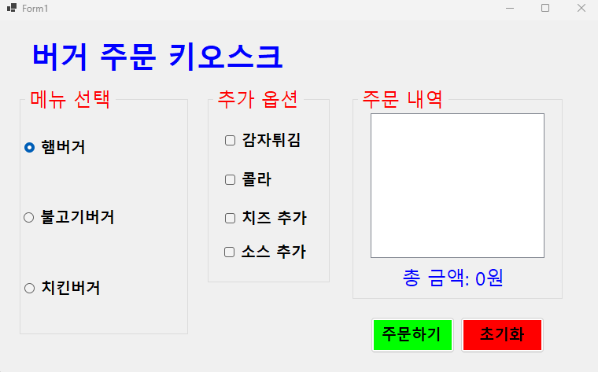
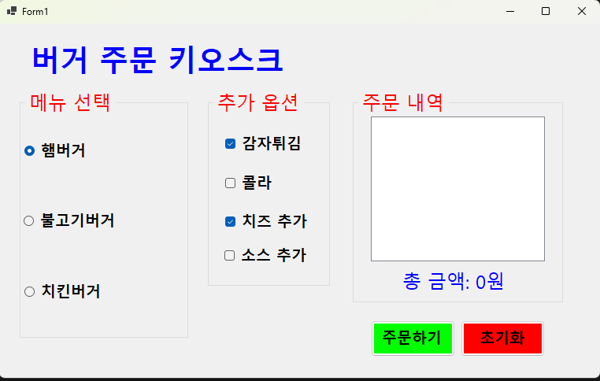
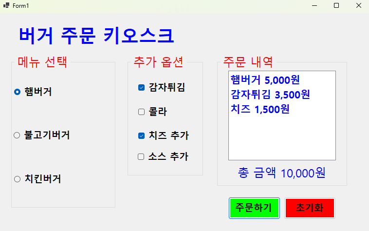
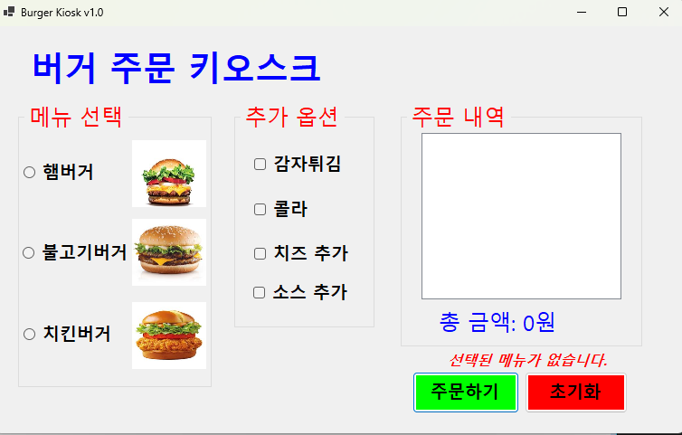
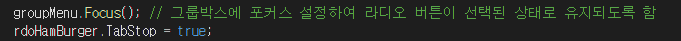
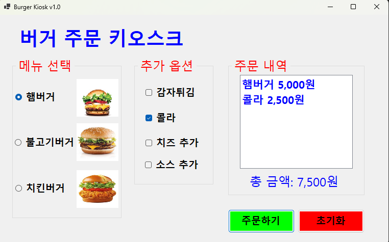
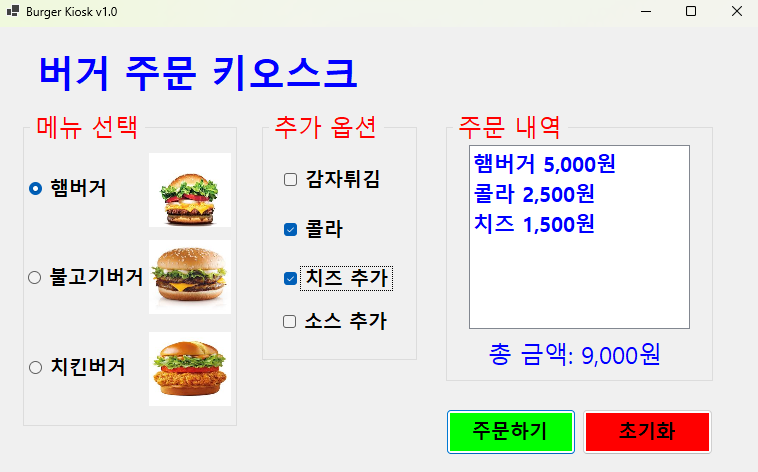
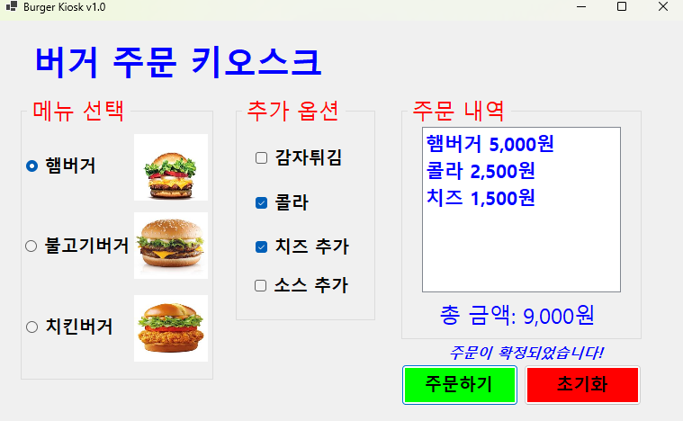

# # (C# 코딩 6주차) 버거 주문 키오스크 (Burger Kiosk) 구현
***-- 22017004 컴퓨터 SW 강희준 --***

## 📑 개요: C# 프로그래밍 학습
- 선택 제어 컨트롤을 활용한 키오스크 주문 시스템 인터페이스 및 로직 구현

###  사용한 플랫폼
- **Language & Framework:** C#, .NET Windows Forms
- **IDE:** Visual Studio 2022
- **Version Control:** GitHub

###  사용한 컨트롤
- **단일 선택:** RadioButton (메인 메뉴 선택용)
- **컨테이너:** GroupBox (메뉴 그룹화)
- **시각화:** PictureBox (메뉴 이미지 출력)
- **입력 및 출력:** Label (제목 및 가격 표시)
- **리스트박스:** ListBox (주문 내역 표시)

### 💻 사용한 기술 및 개념 
- **RadioButton의 특성:** 여러 항목 중 오직 하나만 선택할 수 있는 '단일 선택' 컨트롤의 원리를 이해하고 적용함.

- **GroupBox의 역할:** 연관된 `RadioButton`들을 하나의 `GroupBox`로 묶어, 해당 그룹 내에서만 상호작용되도록 만듬.

- **UI 레이아웃 설계:** 사용자가 메뉴를 바로 인식할 수 있도록 `PictureBox`와 `RadioButton`로 키오스크의 기초 UI를 설계함.

---

## 📸 과제 1: 기본 UI 배치 및 메뉴 선택 기능 구현

|  |  |
  

**✅ 과제 내용**
- 키오스크의 메인 테마에 맞춘 배경색(`MintCream`) 및 제목 Label 설정

- `GroupBox`를 활용하여 햄버거 메뉴 섹션을 분리하고 `RadioButton` 배치

- 각 메뉴에 해당하는 `PictureBox` 이미지를 연결하여 시각적 정보 제공

**💡 상세 구현 내용**
- **메뉴 그룹화:** `groupMenu`라는 이름의 GroupBox를 배치하여 햄버거 종류(햄버거, 불고기버거, 치킨버거)를 관리하였습니다. RadioButton의 `Name` 속성을 `rdoHamBurger`, `rdoBulgogiBurger`, `rdoChickenBurger`로 설정하여 코드 가공성을 높였습니다.

- **이미지 매칭:** 각 라디오버튼 상단에 `picHamBurger`, `picBulGogi` 등 PictureBox를 배치하고 `SizeMode`를 `StretchImage`나 `Zoom`으로 설정하여 정해진 영역 내에 이미지가 깔끔하게 표시되도록 구현하였습니다.

- **기초 로직 준비:** 버튼 클릭 시 어떤 라디오버튼이 `.Checked == true` 상태인지 판별할 수 있도록 이벤트 핸들러(`btnOrder_Click`) 내부에 분기 처리 구조를 설계하였습니다.

**분석 및 학습 포인트**
- **라디오 버튼과 그룹:**  RadioButton은 같은 컨테이너 내에서 하나를 선택하면 나머지가 자동으로 해제되는 특성이 있습니다. 이를 통해 주문 시스템에서 '메인 메뉴' 로직을 간단하게 구현할 수 있었습니다.

---

## 📸 과제 2: 에러 메시지 표시
 
 
 **✅ 과제 내용**
 - 주문 버튼 클릭 시 메뉴가 선택되지 않은 경우 에러 메시지 표시

 - `MessageBox.Show` 메서드를 활용하여 사용자에게 피드백 제공

 - 주문이 정상적으로 처리된 경우에는 선택된 메뉴와 가격을 표시하는 로직 구현

 **💡 상세 구현 내용**
- `btnOrder_Click` 이벤트 핸들러에서 메뉴 선택 여부를 확인하고, 선택되지 않은 경우 `lblError`를 통해 에러 메시지를 표시하도록 구현

- 메뉴가 선택된 경우에는 `lblError`의 텍스트와 색상을 변경하여 주문이 확정되었음을 사용자에게 알림

- reset 버튼 클릭 시 `lblError`의 텍스트와 색상을 초기화하여 다음 주문을 준비할 수 있도록 구현

**분석 및 학습 포인트**
- **사용자 피드백:** 주문 시스템에서는 사용자가 어떤 행동을 했는지 명확히 알 수 있도록 피드백을 제공하는 것이 중요하다는 것을 깨달았습니다.
- 
- `MessageBox.Show`와 `Label` 컨트롤을 활용하여 에러 메시지와 주문 확정 메시지를 효과적으로 전달할 수 있었습니다.

---

## 📸 과제 3: 키보드 사용해서 주문이 가능하게

- 포커스를 그룹 메뉴에다가 주고 탭키가 라디오버튼에 가지않는 것을 해결

**✅ 과제 내용**
- focus 이벤트를 활용하여 키보드로 메뉴 선택 및 주문이 가능하도록 구현

- tab 키로 그룹 간 이동 가능하도록 설정

- 방향키를 이용해서 선택 아이템 사이를 이동하기

- 스페이스바를 이용해서 아이템 선택하기(기본 구현)

- Enter키로 버튼을 누르기

**💡 상세 구현 내용**
- `TabIndex` 속성을 활용하여 `GroupBox`와 버튼 간의 탭 순서를 설정하였습니다. 이를 통해 사용자가 `Tab` 키를 눌러 메뉴 그룹과 주문 버튼 사이를 원활하게 이동할 수 있도록 구현하였습니다.

- `KeyDown` 이벤트 핸들러를 추가하여 방향키와 스페이스바, Enter 키 입력을 처리하였습니다. 방향키 입력 시 현재 선택된 `RadioButton`의 인덱스를 변경하여 메뉴 간 이동이 가능하도록 구현하였습니다.

- 스페이스바 입력 시 현재 포커스된 `RadioButton`의 `Checked` 속성을 토글하여 메뉴 선택이 가능하도록 구현하였습니다.

**분석 및 학습 포인트**
- **접근성 향상:** 키보드 입력을 통해 메뉴 선택과 주문이 가능하도록 구현함으로써, 마우스 사용이 어려운 사용자들도 시스템을 이용할 수 있도록 접근성을 향상시킬 수 있었습니다.

## 📸 과제 4: 선택 즉시 표시정보 갱신하기

- 선택했을 때에 바로 가격과 선택한 메뉴가 표시되도록 구현

- 선택이 바뀌었을 때에도 바로 가격과 선택한 메뉴가 표시되도록 구현

- 주문하기 눌렀을 때 주문이 확정되도록 구현

**✅ 과제 내용**
- 메뉴 선택 시마다 가격과 선택한 메뉴가 `update` 함수를 통해서 즉시 갱신되도록 구현

- 주문 버튼 클릭 시 선택된 메뉴와 가격이 확정되어 표시되도록 구현

**💡 상세 구현 내용**
- `update` 함수를 구현하여 메뉴 선택이 변경될 때마다 `lblSelectedMenu`와 `lblPrice`의 텍스트를 갱신하도록 하였습니다. 이 함수는 각 `RadioButton`의 `CheckedChanged` 이벤트에 연결되어, 메뉴 선택이 변경될 때마다 자동으로 호출됩니다.

- 주문 버튼 클릭 시 `lblError`의 텍스트와 색상을 변경하여 주문이 확정되었음을 사용자에게 알리는 로직을 추가하였습니다.

- `reset` 버튼 클릭 시 `lblSelectedMenu`, `lblPrice`, `lblError`의 텍스트와 색상을 초기화하여 다음 주문을 준비할 수 있도록 구현하였습니다.

**이번 수업 분석 및 학습 포인트**
- **실시간 UI 업데이트:** 메뉴 선택이 변경될 때마다 가격과 선택한 메뉴가 즉시 갱신되도록 구현함으로써, 사용자에게 실시간으로 피드백을 제공할 수 있었습니다. 이를 통해 사용자는 자신의 선택이 어떻게 반영되는지 명확히 알 수 있게 되었습니다.

- **코드 구조 개선:** `update` 함수를 통해 메뉴 선택과 가격 갱신 로직을 중앙화하여 코드의 가독성과 유지보수성을 향상시킬 수 있었습니다.

- **사용자 경험 향상:** 메뉴 선택과 주문 확정 시 명확한 피드백을 제공함으로써, 사용자가 시스템을 보다 직관적으로 이용할 수 있도록 개선하였습니다.

**향후 개선점**
- 메뉴 항목과 가격 정보를 데이터 구조로 관리하여, 새로운 메뉴 추가 시 코드 수정이 최소화되도록 개선시켜보기?.

- 주문 내역을 따로 저장하고, 주문 완료 후 주문 내역을 확인할 수 있는 기능을 추가하여 사용자 경험을 더욱 향상시키기

